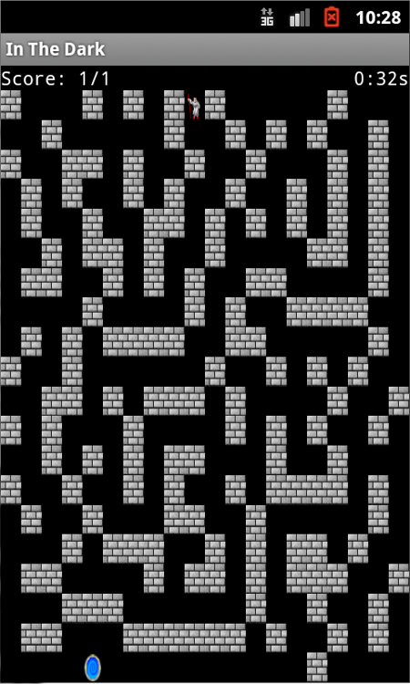
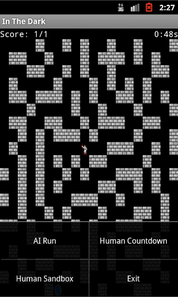

#Cisc181-In-The-Dark

####Summary:
This game is a randomly generated maze game. The goal of the game is to solve each maze as quickly as possible. In the normal gameplay mode, a player has 10 minutes to complete as many mazes, and they can. Each maze is randomly generated each time, and it is likely the player will never re-encounter the same maze twice. The score and high score of the game is the number of mazes completed. There is a simple AI mode, human timed mode, and human sandbox mode.

####How to Play:
To interact with the play in the game, simply click the left mouse button around the player in the direction you wish to move. The player can only be moved along open tiles. In the future an easy implementation of specific phone’s gyroscopes, or accelerometer could easily be added. These types of control were not added, as the reliability of these depends phone by phone.

####Rules:
The rules of the game are very simple. The player must navigate their avatar to the final destination by finding the correct path in the maze. The player cannot move their avatar anywhere except on tiles not occupied by walls, and the player also is on a time limit. The objective is to complete as many mazes as possible in the given timeframe.

####Video:
A video was recorded for the submission of the project, it can probably still be views [here](https://drive.google.com/open?id=0B8HflPJpf1_XLTRiSElWOEgzZGc&authuser=1).

####Copyrights:
All graphics and sound files were taken from opengameart.org, with the copyright of the sound file (The Road of the Moor NES) belonging to Snabisch.The graphics files are public domain.

####Ingame Screenshot
